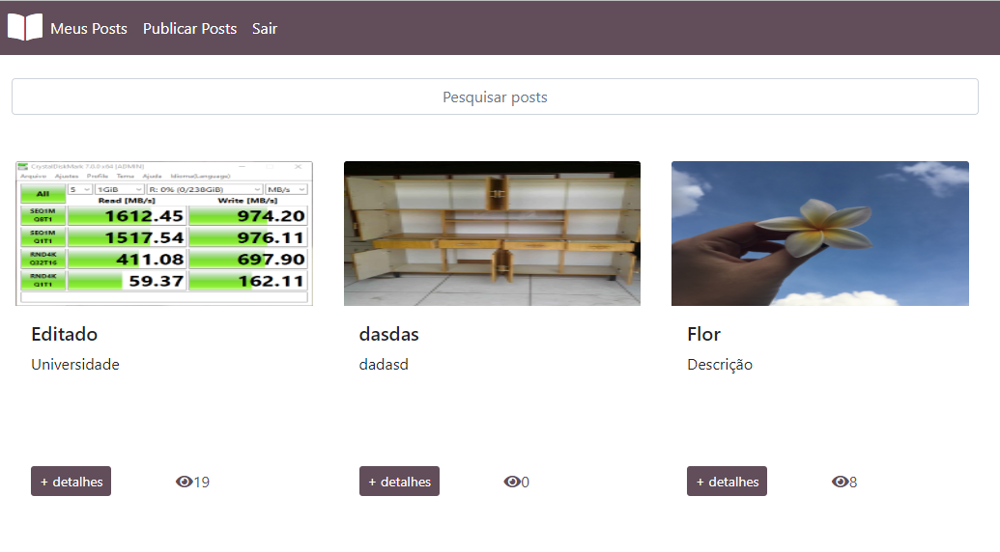
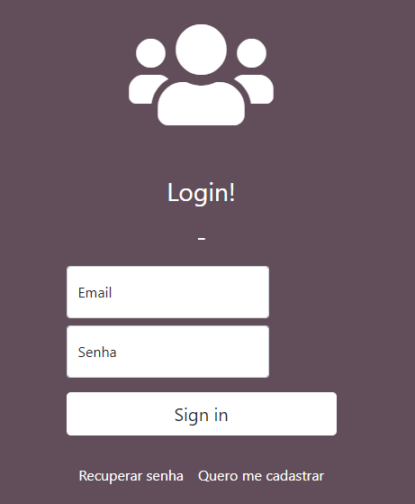
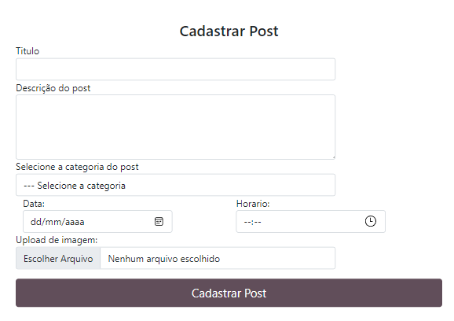

# Post App :clipboard: :calendar: :bookmark: :paperclip:
Aplicativo Web para criação de posts.

## Especificação do Projeto
Estudo de caso, aplicativo Web implementado com React-JS para postagem, fazendo a persistência de dados utilizando Firebase

### Critérios
* [x] Utilizar Firebase como persistência.
* [x] Utilizar REDUX.
* [x] Criar tela de Login.
* [x] Criar cadastrado de usuários.
* [x] Criar tela para redefinir senha.
* [x] Criar cadastro de posts.
* [x] Permitir alteração e exclusão de posts.
* [x] Contador de visitas

## Screenshots

### Tela Inicial


### Login e Cadastro de Posts
 
 

## Dependências
* NodeJS
* npm

## Dependências JS

| Dependência | Versão
|---| ---|
| react | ^17.0.2 |
| react-dom | ^17.0.2 |
| react-router-dom | ^5.2.0 |
| react-scripts | 4.0.3 |
| redux | ^4.0.5 |
| react-redux | ^7.2.3 |
| redux-persist | ^6.0.0 |
| firebase | ^8.3.3 |

### Instalando Dependências JS

```
npm install
```

## Executando a Aplicação

Para executar o APP Web em modo desenvolvedor, use o comando:

```
npm start
```
Abra [http://localhost:3000](http://localhost:3000) para visualizar no navegador.

## Criando Build da Aplicação
Para criar um `build` do APP Web, use o comando:

```
npm run build
```
Esse comando compila o aplicativo para produção, disponibilizando-o na pasta `build`.\
Com a compilação o tamanho da aplicação é reduzida e os nomes dos arquivos incluem os `hashes`.\
Após compilado, estará pronto para ser feito o `Deploy` da aplicação!.

Veja a seção sobre [deployment](https://facebook.github.io/create-react-app/docs/deployment) para mais informações.
