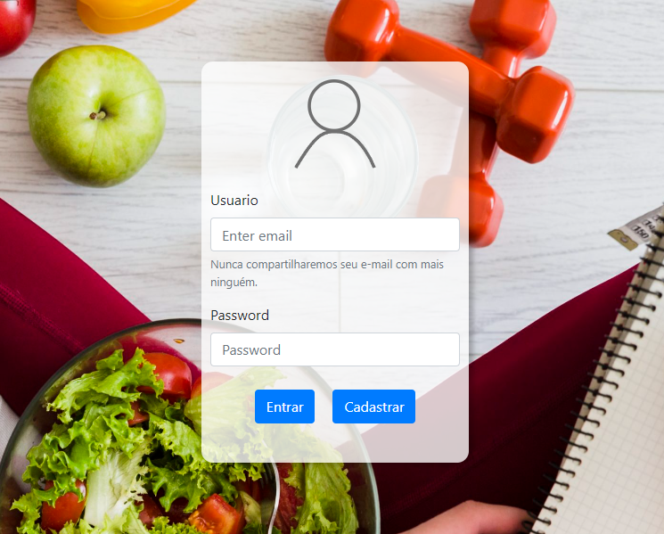
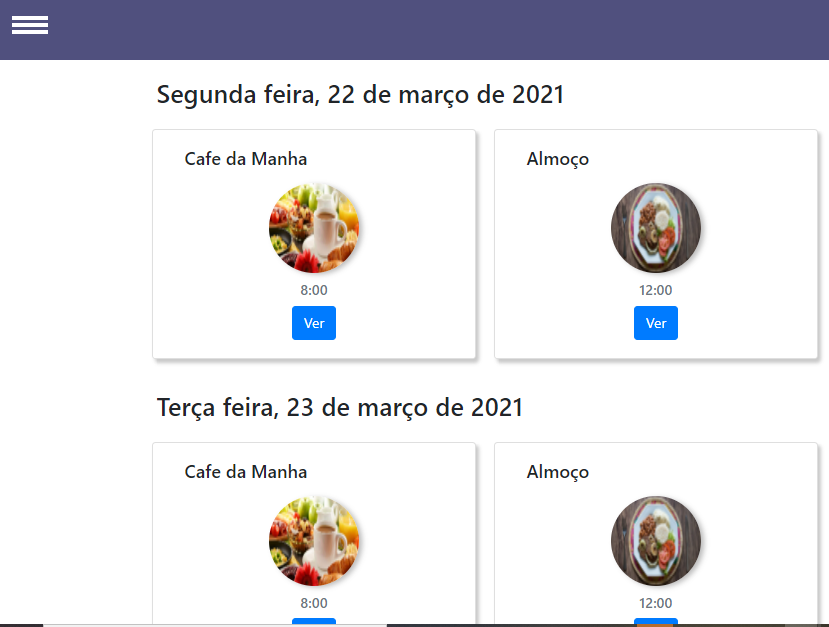
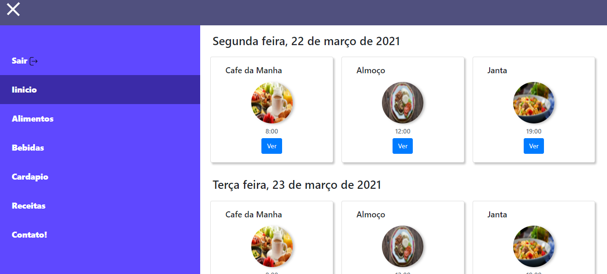
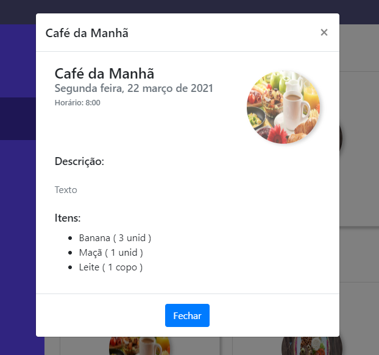
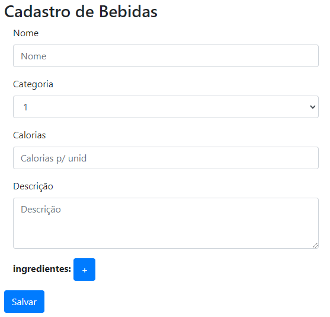
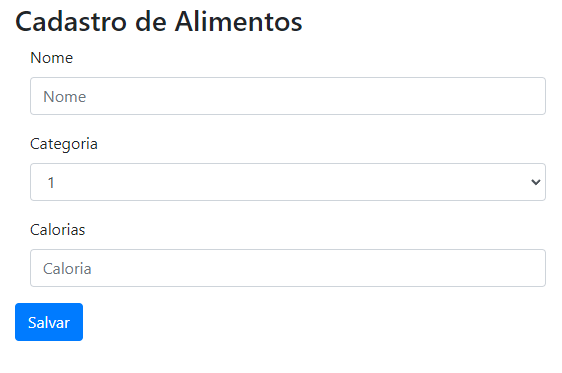
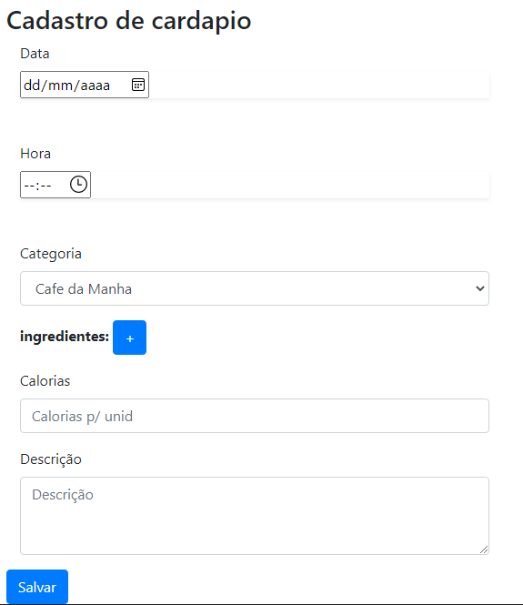
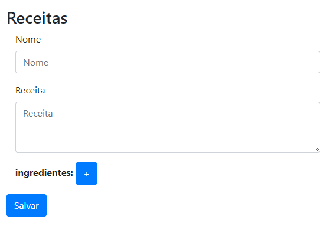
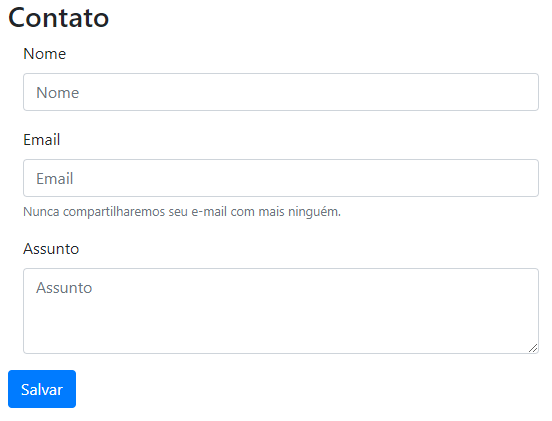

# Minha Dieta :apple: :rice:  :meat_on_bone:
Pagina Web para cadastro de cardapios para dieta de pacientes.

## Especificação do Projeto
Estudo de caso, pagina Web estática utilizando Bootstrap

### Critérios
* [x] Utilizar Bootstrap como framework front-end.
* [x] Criar tela de Login.
* [x] Manipulação do DOM via JS.
* [x] Criar tela de Cadastro.

## Screenshots

### Login

### Home
 
 
 

### Cadastros

 

 
 

 
 ## Framework

| Framework | Versão
|---| ---|
| [Bootstrap](https://getbootstrap.com/) | [4.3.1](https://getbootstrap.com/docs/4.3/getting-started/introduction/) |
