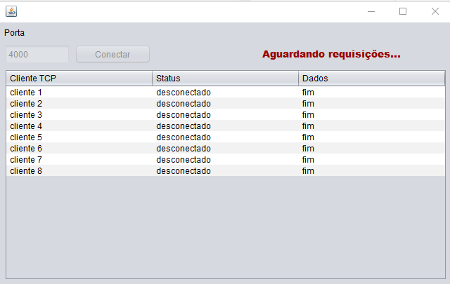
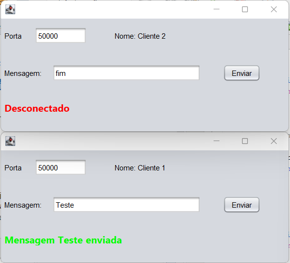
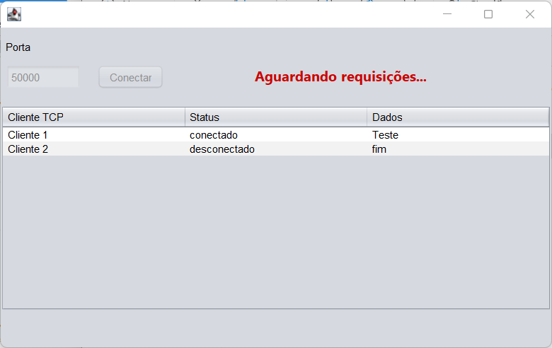

# Cliente e Servidor TCP utilizando JTables 
Trabalho desenvolvido para disciplina de *Programação Distribuida*.
Servidor TCP utilizando threads para conectar via sockets, em que varios clientes podem se conectar simultaneamente. 

## Enunciado
Desenvolva um Servidor e um Cliente em Java que realizam trocas de mensagens via TCP utilizando um JTable.

### O Servidor deverá: 
- Mostrar os clientes conectados em uma tabela.
- Cada linha representará um cliente com seu nome, status (conectado ou desconectado e dados). 
- Assim que o cliente enviar quantas mensagens quiser, a conexão será fechada com uma mensagem ( *fim* ) a ser exibida na tabela, conforme  mostram as figuras abaixo.

## Screenshot
Imagens do projeto desenvolvido

### Cliente
Imagem de dois clientes, um enviando mensagem ***Teste*** e outro ***fim***, o qual altera o *status* da outra maquina para *desconectado*

Servidor aguardando requisições, com dois clientes, um conectado e outro desconectado
### Servidor
