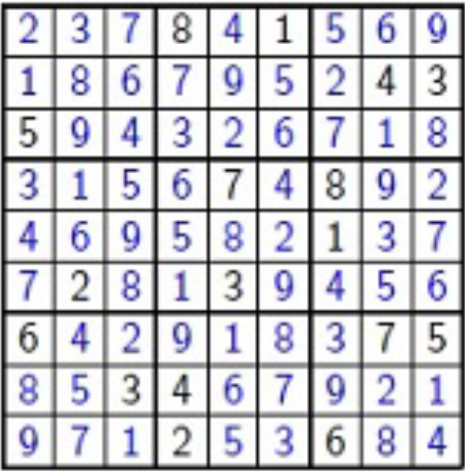

# Sudoku Check
Validador de Sudoku usando Threads.

## Exercício do livro Fundamentos de Sistemas Operacionais de A. Silberschatz, P. Galvin, G. Gagne página 110.

Um quebra-cabeça Sudoku usa um grid de 9x9 em que cada coluna e cada linha, assim como cada um dos nove subgrids 3x3 devem conter todos os dígitos 1...9. 
Esse exercício consiste na elaboração de uma aplicação com múltiplos threads que determine se a solução para um quebra-cabeça Sudoku é válida.

A estratégia sugerida é criar threads em Java que verifiquem os critérios a seguir:
- Um thread para verificar se cada coluna contém os dígitos de 1 a 9
- Um thread para verifica se cada linha contém os dígitos de 1 a 9
- Nove threads para verificar se cada um dos subgrids 3x3 contém os dígitos de 1 a 9

Isso resultaria em um total de onze threads separados para a validação de um quebra-cabeça Sudoku. No entanto, você é incentivado a criar ainda mais threads para o exercício. Por exemplo, pode-se criar nove threads separados e fazer cada um verificar uma coluna.

> Utilizar alguma IDE como *Netbeans* ou *Eclipse*.

### Exemplo de um Sudoku válido

