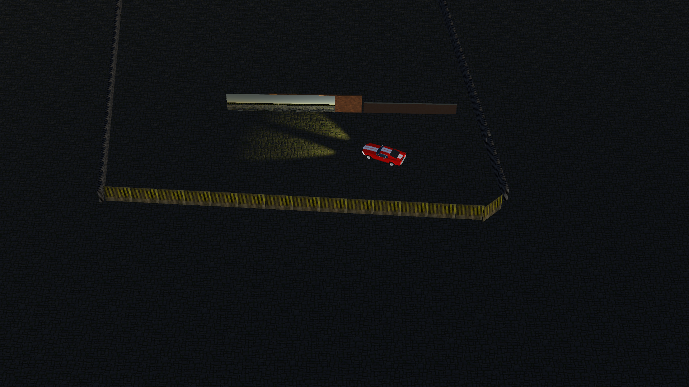

# Projeto Game Pac-Man
Aplicação de computação gráfica em 3D.

## Especificação do Projeto Parte 2

Construir uma aplicação utilizando a Unity ou OpenGL, com os seguintes requisitos mínimos

### Critérios Avaliativos

Faça um jogo em primeira pessoa, no estilo Pac-Man, que tenha os seguintes requisitos:
* [x] Critério 1 - Rotacionar (utilizando no mínimo o teclado – pode-se utilizar além do teclado, o mouse, joystick, etc) (1,0).
* [x] Critério 2 - Transladar (utilizando no mínimo o teclado – pode-se utilizar além do teclado, o mouse, joystick, etc) (1,0).
* [x] Critério 3 - Inserir um ou mais objetos com transparência (1,0).
* [x] Critério 4 - Inserir um ou mais objetos com espelho (1,0).
* [x] Critério 5 – Utilizar pelo menos uma iluminação do tipo point light (1,0).
* [x] Critério 6 – Utilizar pelo menos uma iluminação do tipo spot light (1,0).
* [x] Critério 7 – Utilizar pelo menos um material com mapeamento de texturas do tipo normal map, height map e occlusion (1,0). 

## Screenshots

### Visão Geral

### Visão Aerea
 

### Textura Aplicada a Parede
 

### Spot Light
 

### Point Light
 

### Espelho e Transparência
 

## Dependências
* Unity

