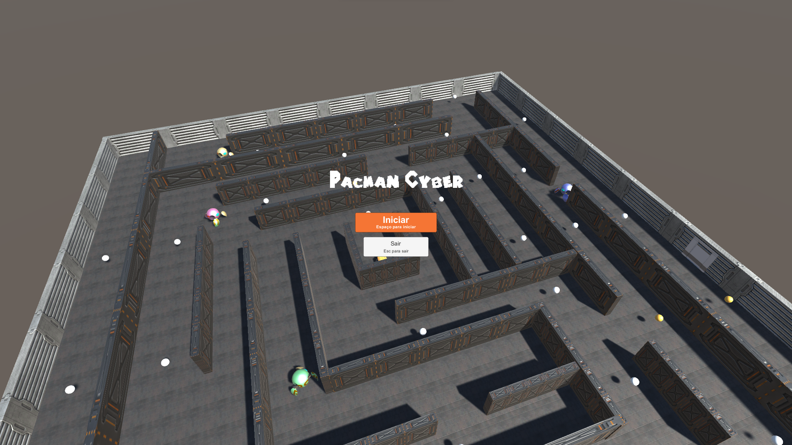
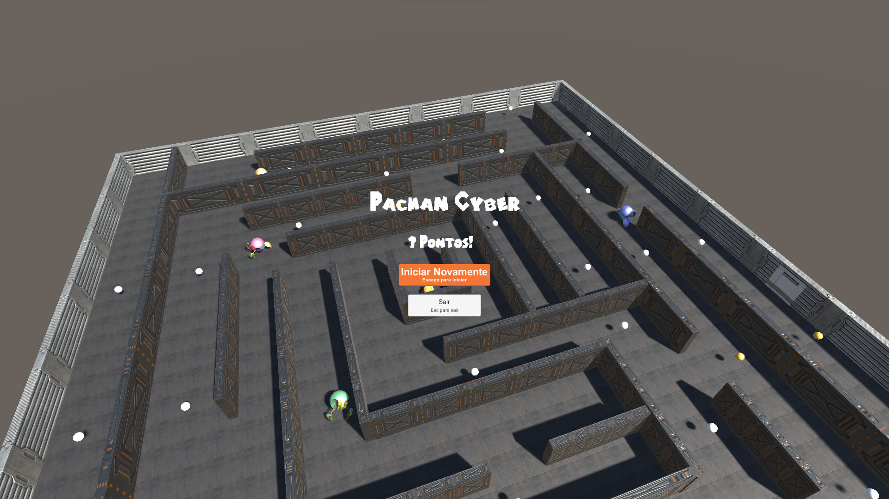
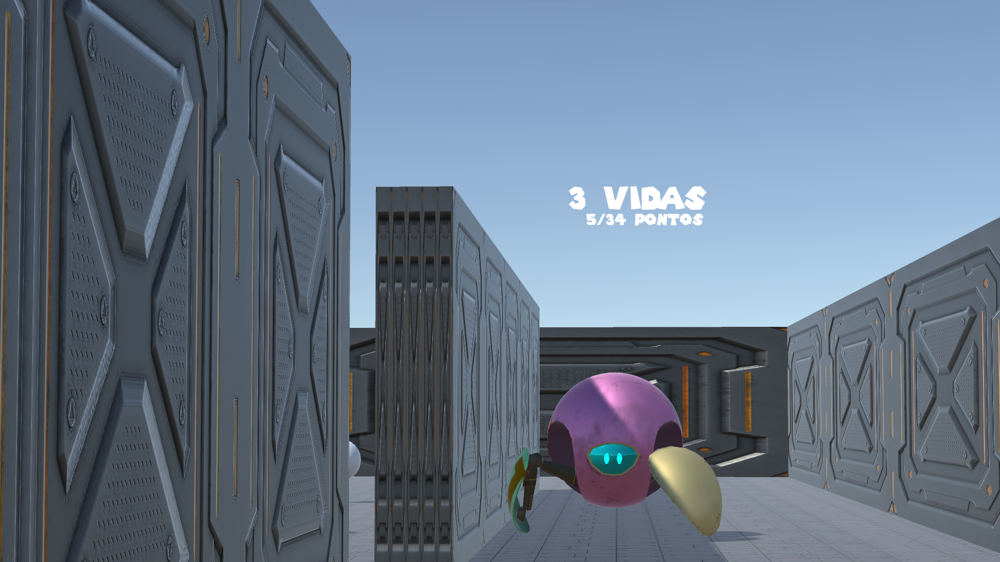
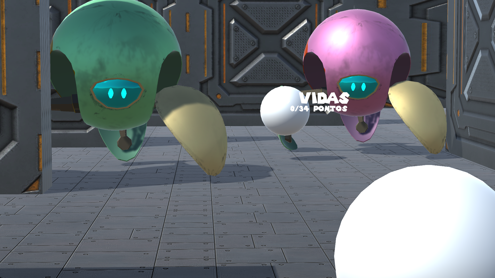
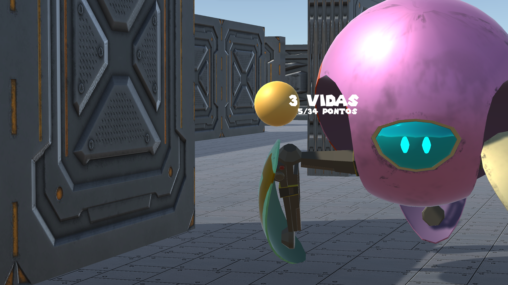
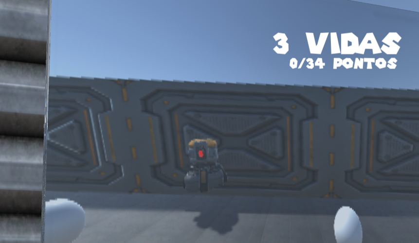
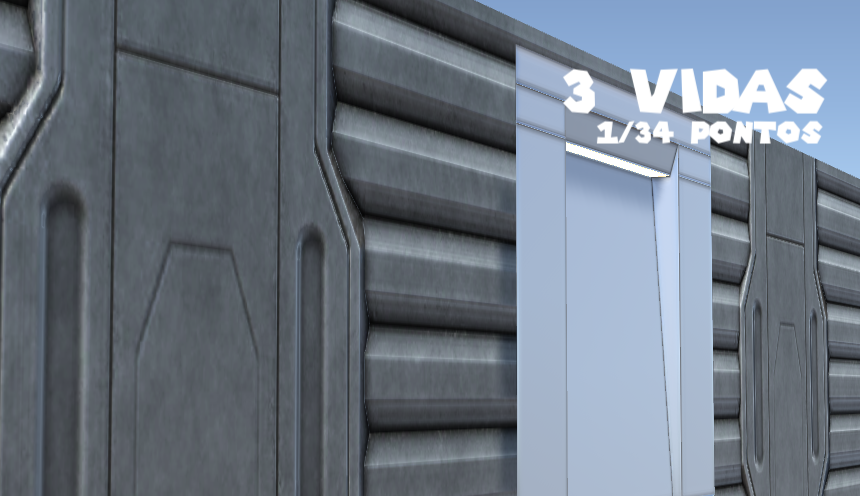

# Projeto Game Plataforma
Projeto de game 3D estilo Pac-Man com inimigos.

## Especificação do Projeto Parte 2

Construir um jogo 3D utilizando a ferramenta Unity:

### Critérios Avaliativos
Faça um jogo em primeira pessoa, no estilo Pac-Man, que tenha os seguintes requisitos:
* [x] Critério 1 - Um labirinto com estrutura semelhante à do PAC-MAN do ATARI (inclusive o teletransporte e espelho!).
* [x] Critério 2 - Quatro personagens não-jogáveis (NPCs) que devem perseguir o personagem principal PC.
    * [x] Se os NPCs tocarem o PC, este deve ser destruído.
* [x] Critério 4 – Um placar.
* [x] Critério 5 – Usar normal map no chão ou parede. 

### Desejavel, mas não exigido
* [x] Critério 6 - Telas adicionais.
    * [x] tela de início.
    * [x] tela de game-over.
* [x] Critério 7 - 3 vidas.
* [x] Critério 8 - Se o PC pegar todas as pílulas, o labirinto deve voltar a ter todas as pílulas novamente, como se o jogador tivesse passado de fase.

Altamente desejável criar um jogo temático (com modelos escolhidos por você). Por exemplo, zumbi, modelo 3D de pac man, futurista, etc...

## Screenshots

### Tela Inicio e Fim
 

### Visão Geral

### Inimigos e Plataforma móvel
 

### Espelho e Portal
 

## Dependências
* Unity

