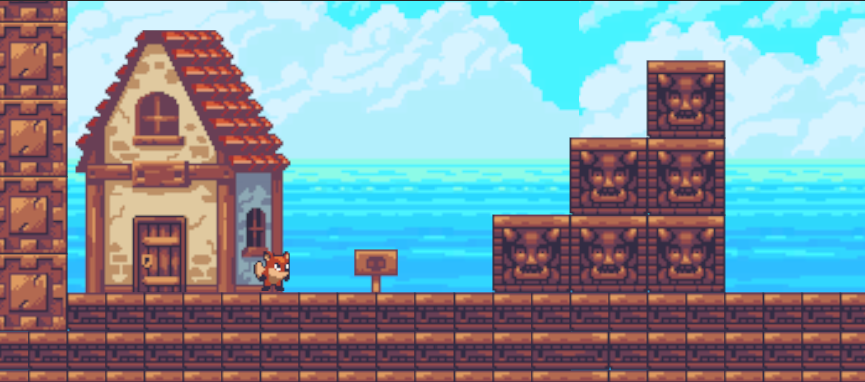

# Projeto Game Plataforma
Projeto de game 2D estilo plataforma com inimigos.

## Especificação do Projeto Parte 1

Construir um jogo plataforma utilizando a ferramenta Unity:

### Critérios Avaliativos
* [x] Critério 1 - Um cenário com pelo menos 6 vezes a largura da tela.
* [x] Critério 2 - Um personagem jogável (PC) com animação de movimento.
* [x] Critério 3 – Um personagem não jogável (NPC) que se move sempre para o mesmo lado. 
    * [x] Se este personagem bater em um obstáculo, deve inverter o movimento.
    * [x] Se o NPC colidir de frente com o PC, o PC deve ser destruído.
* [x] Critério 4 – Se o PC pular na cabeça do NPC, o NPC deve ser destruído.
* [x] Critério 5 – Um piso (plataforma), este piso deve ter duas barreiras (obstáculos), uma em cada extremidade, para que não seja possível o PC e NPC caírem. 
* [x] Critério 6 - Precisa ter uma plataforma móvel.
* [x] Critério 7 - O jogo deve possuir uma tela de início com os botões de iniciar e sair.

## Screenshots

### Tela Inicio

### Parte 1

### Plataforma móvel

### Inimigo

### Tela Fim

## Dependências
* Unity

